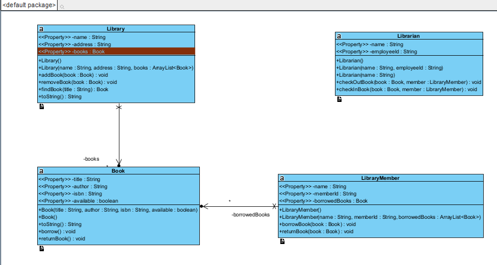

# Library Management System

## Overview
This is a basic Library Management System implemented in Java. The system includes classes for managing the library, books, librarians, and library members. The relationships between these classes are designed to facilitate book borrowing and returning operations.

## Classes

### 1. Library
- **Attributes:**
  - `name: String`
  - `address: String`
  - `books: List<Book>`

- **Methods:**
  - `addBook(book: Book): void`
  - `removeBook(book: Book): void`
  - `findBook(title: String): Book`

### 2. Book
- **Attributes:**
  - `title: String`
  - `author: String`
  - `isbn: String`
  - `available: boolean`

- **Methods:**
  - `borrow(): void`
  - `returnBook(): void`

### 3. Librarian
- **Attributes:**
  - `name: String`
  - `employeeId: String`

- **Methods:**
  - `checkOutBook(book: Book, member: LibraryMember): void`
  - `checkInBook(book: Book, member: LibraryMember): void`

### 4. LibraryMember
- **Attributes:**
  - `name: String`
  - `memberId: String`
  - `borrowedBooks: List<Book>`

- **Methods:**
  - `borrowBook(book: Book): void`
  - `returnBook(book: Book): void`

## Relationships
- A Library has zero or more Books.
- A Librarian can check out and check in Books for LibraryMembers.
- A LibraryMember can borrow and return Books.
## Class Diagram 

